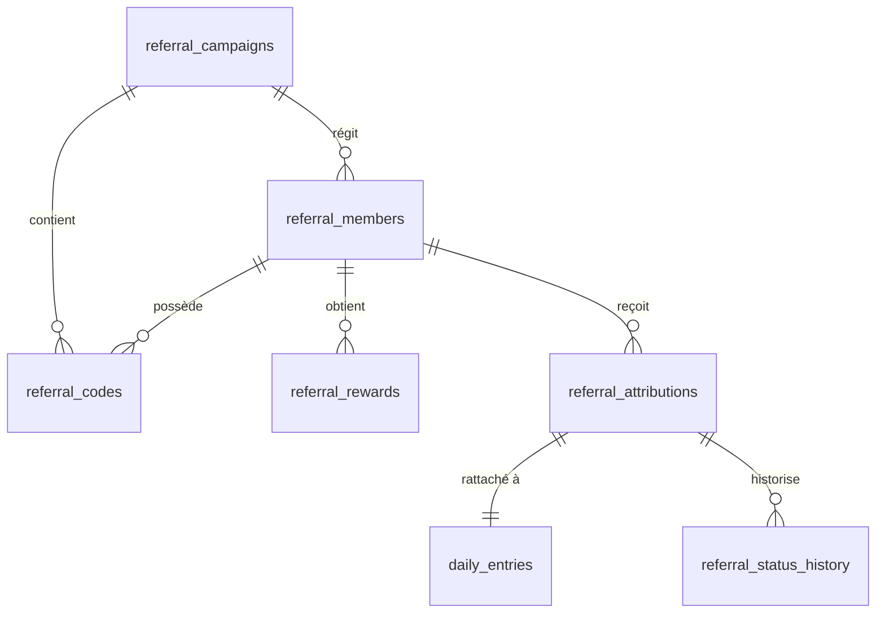

# Schéma et Modèle de Données du Module de Parrainage (Firestore)

Ce document décrit en détail la structure des collections Firestore, les relations, les contraintes d'intégrité et la gestion des index nécessaires au fonctionnement du programme de parrainage de NYA BLO pour GALF Formation.

---

## 1. Vue d'ensemble des Collections

Le module introduit **7 nouvelles collections** dans la base de données :

---

## 2. Dictionnaire des Données et Schemas

### A. Collection `referral_campaigns`
Contient les campagnes temporelles de parrainage.
* **ID Document** : Généré par Firestore ou personnalisé (ex: `campagne_2026`).

| Champ | Type | Description / Contraintes |
| :--- | :--- | :--- |
| `id` | `string` | Identifiant unique de la campagne |
| `name` | `string` | Nom de la campagne (ex: "Campagne Annuelle 2026") |
| `description` | `string` | Description des règles ou objectifs |
| `status` | `string` | Valeurs : `"active"`, `"expired"`, `"draft"` |
| `startDate` | `string` | Date de début au format `YYYY-MM-DD` |
| `endDate` | `string` | Date de fin au format `YYYY-MM-DD` |
| `createdAt` | `string` | Timestamp ISO de création |

---

### B. Collection `referral_members`
Représente les parrains inscrits au programme.
* **ID Document** : Généré (ex: `member_1718723901823`).

| Champ | Type | Description / Contraintes |
| :--- | :--- | :--- |
| `id` | `string` | Identifiant du membre parrain |
| `nom` | `string` | Nom du parrain |
| `prenom` | `string` | Prénom du parrain |
| `email` | `string` | Email de contact |
| `telephoneNormalise` | `string` | Numéro de téléphone standardisé (ex: `+2250707070707`) |
| `formationSouhaitee` | `string` | Nom de la formation souhaitée offerte en récompense |
| `campagneId` | `string` | ID de la campagne active associée |
| `codeId` | `string` | Code parrain rattaché |
| `status` | `string` | Valeurs : `"active"`, `"suspended"`, `"archived"` |
| `createdAt` | `string` | Timestamp ISO de création |
| `recordedBy` | `string` | UID de l'utilisateur ayant saisi le parrain |
| `stats` | `map` | Sous-structure contenant les indicateurs clés (voir ci-dessous) |

#### Structure `stats` :
* `totalReferred` (`number`) : Nombre total de filleuls enregistrés (tous statuts).
* `pendingCount` (`number`) : Nombre de filleuls en attente (inscriptions non encore validées).
* `validatedCount` (`number`) : Nombre de filleuls validés (statuts `"Confirmé"`, `"inscription validée"`).
* `rewardCount` (`number`) : Nombre total de récompenses attribuées au membre.

---

### C. Collection `referral_codes`
Contient l'indexation des codes pour une recherche directe ultra-rapide.
* **ID Document** : Le code parrain lui-même en MAJUSCULES (ex: `MAMADOU26`). *Garantit l'unicité globale du code parrain.*

| Champ | Type | Description / Contraintes |
| :--- | :--- | :--- |
| `code` | `string` | Le code parrain (ex: "MAMADOU26") |
| `memberId` | `string` | ID du parrain propriétaire (relation vers `referral_members`) |
| `campaignId` | `string` | ID de la campagne associée |
| `status` | `string` | Valeurs : `"active"`, `"suspended"` |
| `createdAt` | `string` | Timestamp ISO de création |
| `expiresAt` | `string` \| `null` | Date d'expiration optionnelle au format ISO |

---

### D. Collection `referral_attributions`
Représente le rattachement d'un filleul (une saisie d'inscription) à un parrain.
* **ID Document** : Généré par Firestore.

| Champ | Type | Description / Contraintes |
| :--- | :--- | :--- |
| `entryId` | `string` | ID de la saisie d'origine (relation directe vers `daily_entries`) |
| `studentName` | `string` | Nom du filleul inscrit |
| `studentPhone` | `string` | Téléphone brut du filleul |
| `studentPhoneNormalized` | `string` | Numéro du filleul nettoyé sans caractères spéciaux (ex: `2250707070707`) |
| `referralMemberId` | `string` | ID du parrain bénéficiaire |
| `referralCodeId` | `string` | Le code parrain utilisé |
| `campaignId` | `string` | ID de la campagne |
| `attributionMethod` | `string` | Origine : `"manual"`, `"qr_code"`, `"link"`, `"search"`, `"admin"` |
| `recordedBy` | `string` | Email/UID de la commerciale ayant fait la saisie |
| `recordedByName` | `string` | Nom de la commerciale ayant fait la saisie |
| `status` | `string` | Statut de l'inscription (synchronisé avec `daily_entries.status`) |
| `note` | `string` | Notes sur l'attribution ou modification |
| `createdAt` | `string` | Timestamp ISO de création |
| `updatedAt` | `string` | Timestamp ISO de mise à jour |

---

### E. Collection `referral_rewards`
Gère les dossiers de récompenses (1 formation offerte tous les 5 filleuls validés).
* **ID Document** : Généré par Firestore.

| Champ | Type | Description / Contraintes |
| :--- | :--- | :--- |
| `memberId` | `string` | ID du parrain bénéficiaire |
| `reference` | `string` | Numéro de dossier unique (ex: `GALF-REWARD-2026-000001`) |
| `qualifyingCount` | `number` | Fixé à `5` (nombre d'inscriptions requises pour déclenchement) |
| `status` | `string` | Cycle de vie de la récompense (voir ci-dessous) |
| `trainingId` | `string` \| `null` | Formation offerte sélectionnée par l'administrateur |
| `centerId` | `string` \| `null` | Centre de formation attribué |
| `approvedBy` | `string` \| `null` | Email de l'administrateur ayant validé le dossier |
| `approvedAt` | `string` \| `null` | Timestamp ISO de la validation |
| `expiresAt` | `string` | Date limite d'utilisation (par défaut, `createdAt + 1 an`) |
| `createdAt` | `string` | Timestamp ISO de création |
| `qualifyingEntries` | `array (string)` | Liste des `entryId` ayant qualifié la récompense |

#### Cycle de vie des statuts de récompense (`status`) :
1. `eligible` : Créée automatiquement par le système lorsque la progression atteint un multiple de 5 validés.
2. `verification_en_cours` : En cours d'analyse anti-fraude par le superviseur.
3. `informations_requises` : Commerciale sollicitée pour clarification.
4. `approuvee` : Validée par l'admin (prête à être programmée).
5. `programmee` : Session et centre affectés, parrain notifié.
6. `attribuee` : Lettre d'attribution officielle générée et remise.
7. `utilisee` : Formation terminée, dossier clôturé.
8. `refusee` : Fraude suspectée ou dossier rejeté.
9. `expiree` : Validité de 12 mois dépassée sans réservation.

---

### F. Collection `referral_status_history`
Historique complet des changements de statuts sur les attributions.

| Champ | Type | Description |
| :--- | :--- | :--- |
| `attributionId` | `string` | ID de l'attribution concernée |
| `previousStatus` | `string` | Statut avant modification |
| `newStatus` | `string` | Nouveau statut appliqué |
| `changedBy` | `string` | Email de l'utilisateur |
| `reason` | `string` | Motif de la modification (obligatoire) |
| `createdAt` | `string` | Date du changement |

---

### G. Collection `referral_audit_logs`
Logs globaux pour le suivi d'activité et la conformité administrative.

| Champ | Type | Description |
| :--- | :--- | :--- |
| `userId` | `string` | UID de l'utilisateur |
| `userEmail` | `string` | Email de l'utilisateur (ou `"system"`) |
| `action` | `string` | Type d'action (ex: `"reward_created"`, `"reward_decision"`) |
| `details` | `string` | Description narrative de l'action |
| `timestamp` | `string` | Date ISO |

---

## 3. Index Composés Requis

Pour assurer les performances des requêtes sans impact sur le chargement de l'application Next.js, les index composés suivants doivent être configurés dans Firestore (`firestore.indexes.json`) :

1. **Recherche de filleuls par parrain et statut** :
   * Collection : `referral_attributions`
   * Champs : `referralMemberId` (Ascendant) + `status` (Ascendant)
2. **Recherche de récompenses par parrain** :
   * Collection : `referral_rewards`
   * Champs : `memberId` (Ascendant) + `createdAt` (Descendant)
3. **Audit logs chronologiques** :
   * Collection : `referral_audit_logs`
   * Champs : `timestamp` (Descendant)
