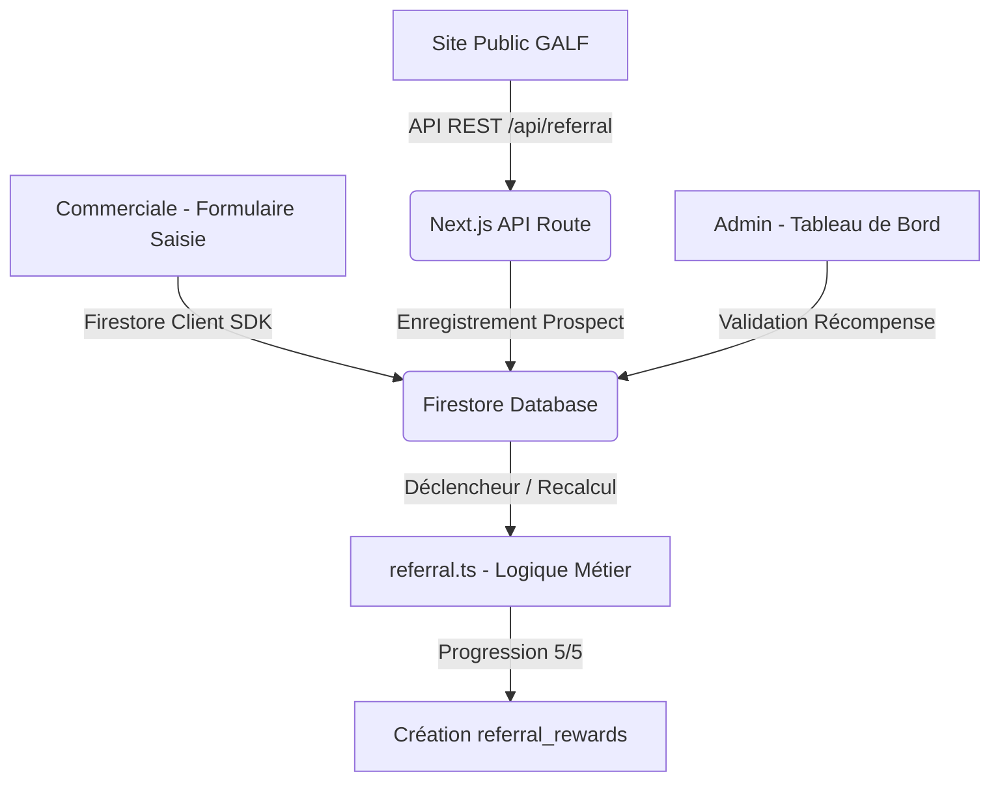

# Module de Parrainage NYA BLO - Guide Général

Ce document décrit le fonctionnement global, l'architecture technique et l'intégration du module de parrainage « 5 inscriptions validées = 1 formation offerte » au sein de la plateforme de gestion interne **NYA BLO GESTION** pour **GALF Formation**.

---

## 1. Fonctionnalités Clés

Le module permet de gérer et de suivre tout le cycle de vie du programme de parrainage :
1. **Saisie Commerciale Intégrée** : Lors de chaque saisie d'un apprenant (dans [EntryModal.tsx](file:///c:/Users/NYAMMA/NB%20GEST/src/components/dashboard/EntryModal.tsx)), la commerciale indique si l'apprenant possède un code. Le code est vérifié instantanément et l'apprenant est lié au parrain après confirmation.
2. **Scan de Code QR** : Un simulateur interactif de scan QR permet d'authentifier les codes issus des coupons imprimés ou mobiles.
3. **Mise à Jour Dynamique de la Progression** : Le compteur du parrain (de 0/5 à 5/5) est recalculé dynamiquement sur la base des inscriptions réelles ayant le statut `"inscription validée"` ou `"Confirmé"`.
4. **Contrôle Anti-Fraude** : Détection des auto-parrainages (par comparaison de téléphone), des inscriptions anormalement rapides ou des doublons de numéros de téléphone.
5. **Dossier de Récompenses Automatique** : Dès qu'un parrain atteint 5 filleuls validés, un dossier de récompense unique (Ex: `GALF-REWARD-2026-000001`) est généré. La formation n'est jamais attribuée d'office ; elle requiert une validation administrative dans l'onglet dédié.
6. **API Sécurisée pour GALF** : Un endpoint REST sous `/api/referral` permet de connecter le site public de GALF Formation pour vérifier les codes en direct et enregistrer des prospects pré-parrainés.

---

## 2. Architecture du Module

Le module est entièrement intégré dans l'application Next.js 16 existante sans perturber le fonctionnement des fiches ou des filiales existantes :

### Emplacement des Fichiers
- **Logique Métier & Calculs** : [referral.ts](file:///c:/Users/NYAMMA/NB%20GEST/src/lib/referral.ts)
- **Formulaire de Saisie** : [EntryModal.tsx](file:///c:/Users/NYAMMA/NB%20GEST/src/components/dashboard/EntryModal.tsx)
- **Liste des Points Journaliers** : [page.tsx](file:///c:/Users/NYAMMA/NB%20GEST/src/app/dashboard/entries/page.tsx)
- **Tableau de Bord Parrainage** : [page.tsx](file:///c:/Users/NYAMMA/NB%20GEST/src/app/dashboard/parrainage/page.tsx)
- **API Distante** : [route.ts](file:///c:/Users/NYAMMA/NB%20GEST/src/app/api/referral/route.ts)
- **Scripts de Base de Données & Tests** : [seed-referral.ts](file:///c:/Users/NYAMMA/NB%20GEST/src/scripts/seed-referral.ts) et [test-referral.ts](file:///c:/Users/NYAMMA/NB%20GEST/src/scripts/test-referral.ts)
